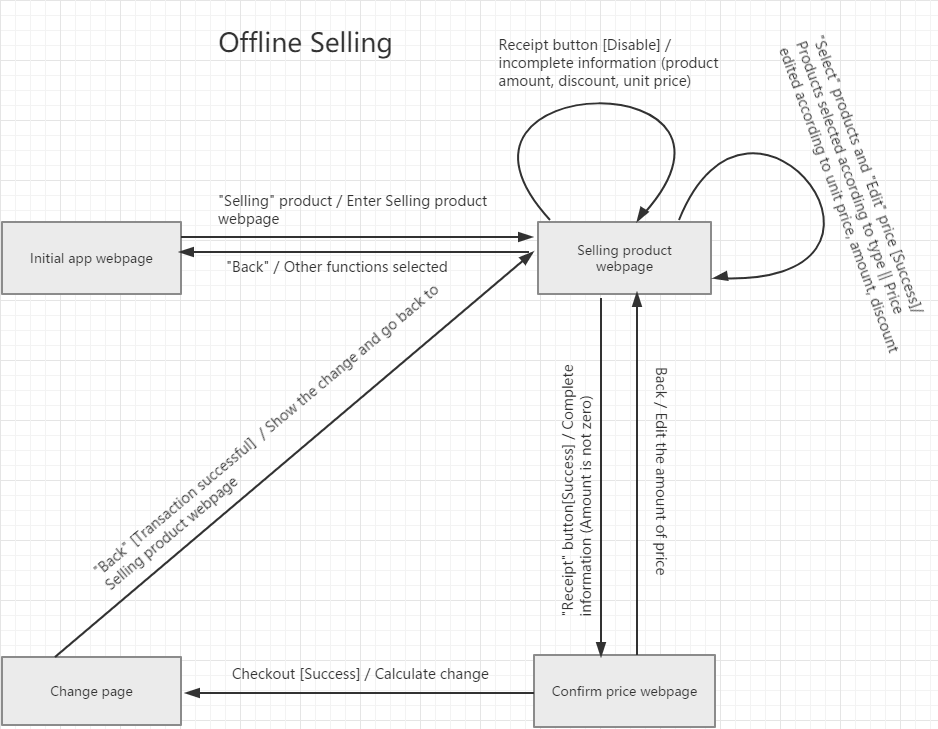
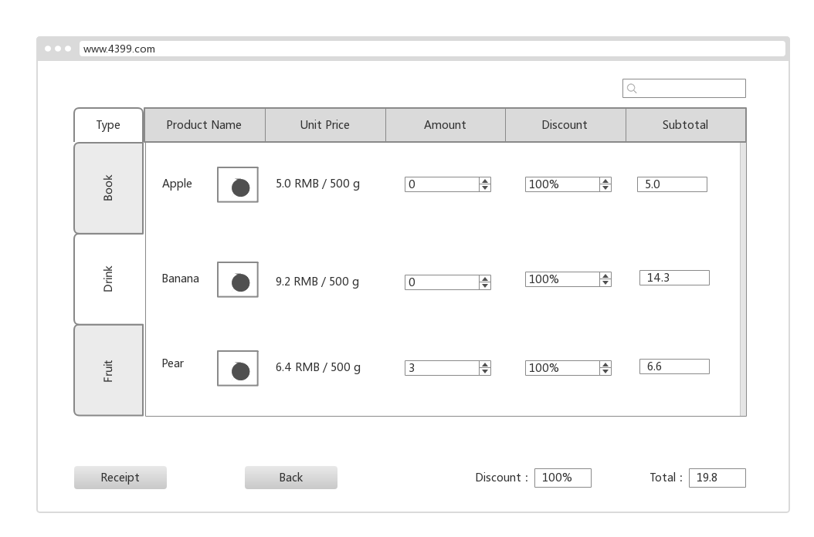
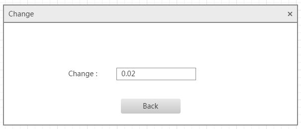
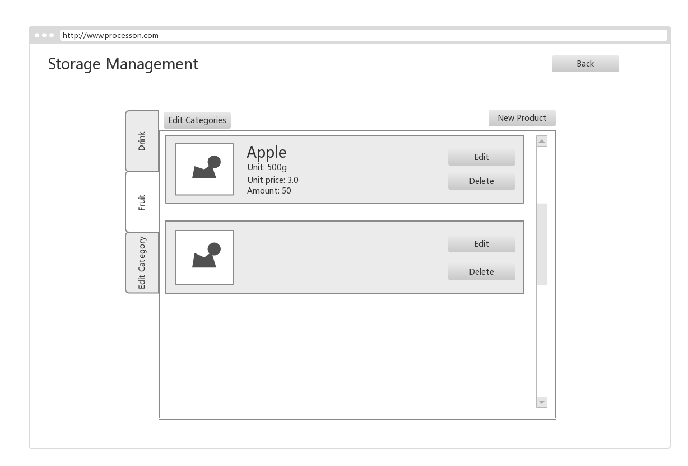
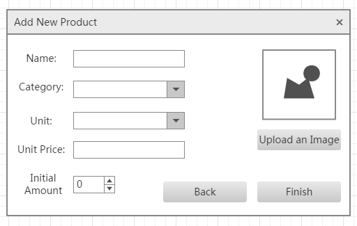
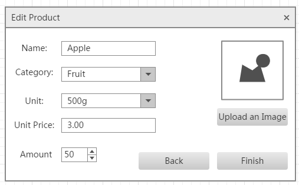
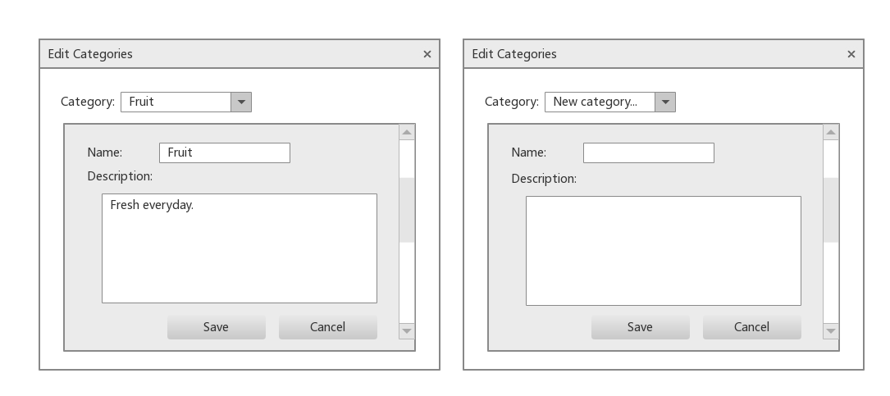

# Retail Management System - Partial Description 

According to requirements we discussed before, we made a plan (6/5 - 6/9) to finish Transaction diagram and UI Prototype, then we divided this software into three main parts:

- Selling 
  - Offline Selling
- Storage Management
  - Add new commodity
  - Edit product information

*UI Prototype is a rough design of User Interface of the software. The actual implementation may have sightly differences.*

*Transaction diagram indicates the interaction of the system when events are triggered.*

## Selling

Selling function helps seller finish transaction more quickly and efficiently. We designed the off-line selling at beginning.

### Off-line Selling

Off-line Selling adapts small shop which does not have much types of commodity. It has three main User Interface, and there are Off-line Selling's transaction diagrams, UI Prototypes.

#### Off-line Selling Transaction Diagram and UI Prototype 

1. In initial app webpage, if Seller chooses selling function in initial app webpage, then webpage will jump into Selling product webpage. 
2. In Selling product webpage, there are different types of product at left navigation bar. Seller can choose product and input basic information of product, including product name, unit price, amount,discount, and subtotal. Seller should also input total discount and price at last. And next seller click "Receipt" button. If the information is incomplete, it will give a warning. Else if the information is complete, it will jump "Confirm price webpage". Else click "Back" button, then go back to Initial app webpage. [Figure1.1]
3. In confirm price webpage, product total price will be shown. Adding that, seller should input the receipt. If the price and receipt is correct, then click "Confirmation", go to Change page. Else it will go back to Selling product webpage to change the price. [Figure 1.2]
4. In change page, the transaction has been finished, and it will show the how much the seller should change for customers. Then, click "Back", go back to Selling product webpage, and prepare for next transaction. [Figure 1.3]

Figure 1.1

Figure 1.2

Figure 1.3

## Storage Management

Storage management is a entrance of editing product information and add new products. 

Here is the main interface of *Storage Management*.

From left to right, form top to bottom, the elements are arranged in the order which shown on the prototype. Here are descriptions of them. 

* There is a header on the top-left side of the page, indicates this is the *Store Management* page. 

* On the left hand side is a list of categories. Products are classified according to their categories which inputed when the products are firstly added to the system. 

* "Edit Categories" button allows users to edit existing categories or add new categories. 

* On the right-top side is a button says "New Product", when the button is clicked, a pop-up window will showed to allow user to add new product to the system.

* Right in the middle is a list of products of selected category. Every product has its picture, name, unit, unit price, and amount. 

  An "Edit" button is placed on the right. User can edit information of a product (including amount) by clicking the "Edit" button of **the** product. 

  A "Delete" button is also placed on the right. User can delete the product by clicking "Delete" button. 

Here is the interface of adding new product. 

From left to right, top to bottom, the descriptions of each field is shown below. 

* On the left half is a form of information of a product. All fields are required to be filled. 
  * **Name**: name of the product. 
  * **Category**: the category of the new product. The system gives a list of existing categories, the user should choose one of these categories. 
  * **Unit**: indicates the counting unit of the product. User can choose one from the given units, or use creating new unit.
  * **Unit Price**: indicates the price of each unit of the product. 
  * **Initial Amount**: indicates the initial amount when the new product is first added. 

* On the right hand side, a place allows the user to upload a picture for this product. 

* "Back" button allows user to close the window and return to the previous page. 

* "Finish" button. When clicked, the following will be checked. 

  *If the following conditions matched, the window will close and the new product will be saved.*

  *If the following conditions not match, a warning will be given and remain in this state.*

  * **All** fields of the form on the left should be filled. 
  * **Unit price** and **Initial Amount** can not be negative. 

Here is the interface for editing product. The fields and description are similar to *Add New Product*.

Here is the interface of editing categories.

Users can select a category at the list on the top. The list will show all existing categories and an extra option which is "New Category...". 

* If an existing category is selected, its information will be displayed on the form below. 
* If "New Category..." option is selected, the form will become empty an allow the users to add contents. 

Once "Save" button is clicked, the system will check form above. 

* If the form is empty, it will give a warning, otherwise, the new category / updated information will be saved, and the window will close. 